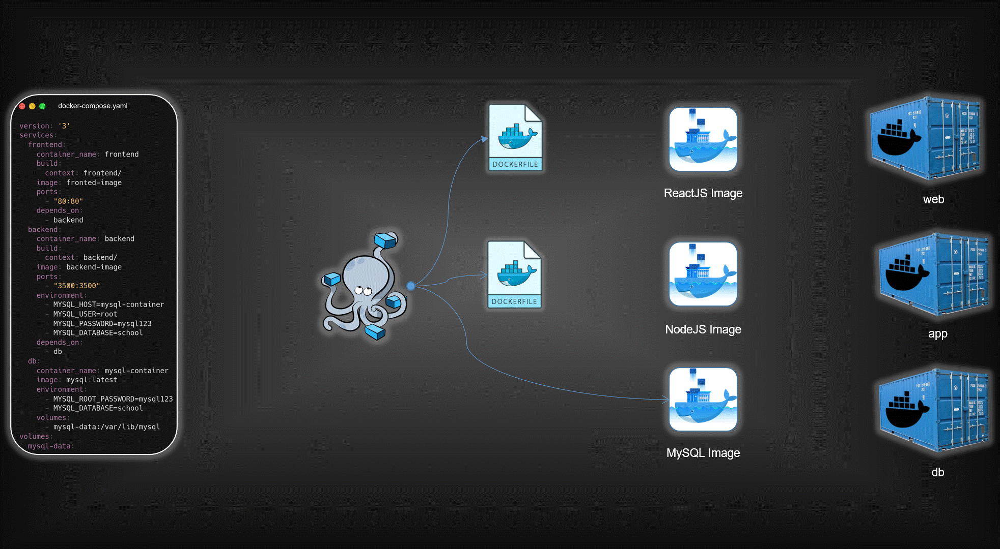

# 🚀 Three-Tier Application Deployment using Docker Compose  

[](https://www.linkedin.com/in/omprakash-chauhan-07b1b3233/)  
[](https://github.com/omprakash2929)  
[](https://hub.docker.com/u/avian19)  


## 📌 Overview
This project demonstrates the deployment of a **Three-Tier Application** using **Docker Compose**.  
The architecture consists of:  

- 🗄️ **MySQL Database** – Persistent data storage  
- ⚙️ **Node.js Backend** – RESTful API layer  
- 🎨 **React.js Frontend** – User interface  



--

## 🛠️ Prerequisites
Before running the project, ensure you have installed:  

- [Docker](https://www.docker.com/get-started)  
- [Docker Compose](https://docs.docker.com/compose/install/)  

---

## 📂 Project Structure
```
├── backend/ # Node.js backend (API)
│ ├── Dockerfile
│ └── ...
├── frontend/ # React.js frontend
│ ├── Dockerfile
│ └── ...
├── docker-compose.yml # Docker Compose configuration
├── student-teacher-app/ # Frontend application code
└── README.md
```

## 🚀 Deployment Steps

 ### 1️⃣ Clone the Repository
   ```
   git clone <repository-url>
   cd <repository-directory>
   ```

### 2️⃣ Build & Run Containers
   #### Use Docker Compose to build and run all containers:
   ```
    docker-compose up -d
   ```

### 3️⃣ Access the Application
   #### Open your browser and visit:
   ```
👉 http://localhost:80
   ```

## 💾 Data Persistence
  - The MySQL database uses Docker Volumes for persistent storage.
  - Even if the MySQL container is removed, the data remains intact and will be reloaded in a new container.  
   
## 📖 Learning Outcomes
 #### By exploring this repository, you will:
   - Understand three-tier architecture deployment using Docker Compose.
   - Learn how to configure persistent storage with Docker volumes.
   - Gain experience deploying MERN stack applications inside containers
## 🙌 Contribution
Contributions are welcome! Feel free to fork this repo, submit issues, or open pull requests to enhance the project.
